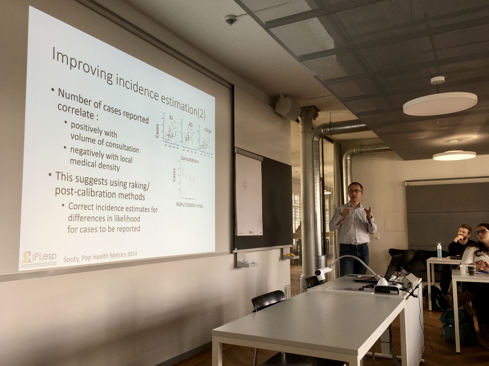
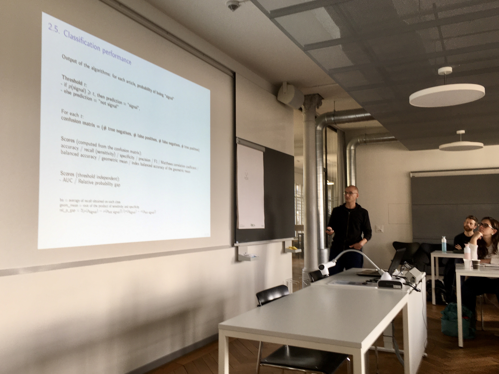
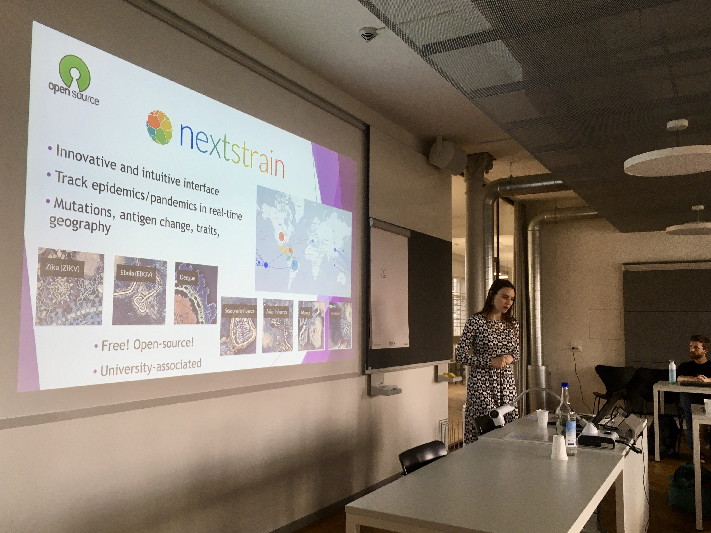
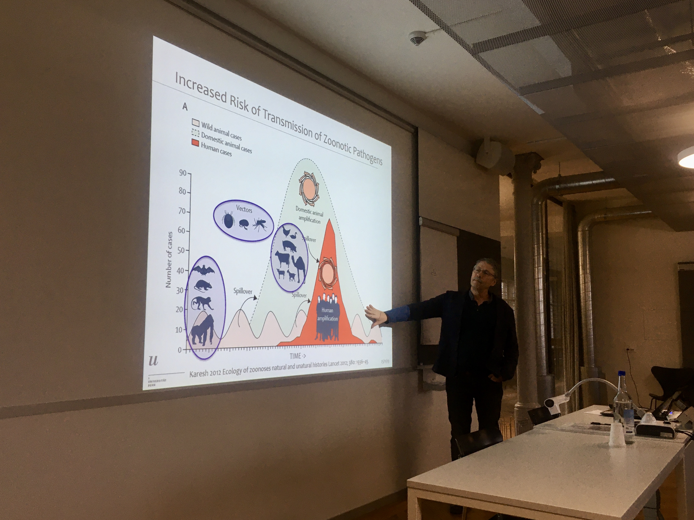

# Workshop Infectious Disease Surveillance

Infectious disease surveillance is the action of monitoring the health status of a population in order to predict, observe, and mitigate the harm caused by infectious diseases to a population. It traditionally relies upon mandatory or voluntary declaration of diagnosed cases by networks of health professionals, such as the Sentinella network in Switzerland. Modern approaches based on internet data (e.g., search queries) and machine learning are increasingly used to complement classical approaches in monitoring infections. In all cases, advanced statistical techniques are continuously developed to better assess risks and obtain more reliable predictions and improve the preparedness of public health authorities in case of epidemics.

This workshop provided an overview of the current state in the field of infectious disease surveillance, from the perspective of both data collection and data analysis.

## Information
Date:	25 November 2019
Location: Seminar room 320, University Bern, Mittelstrasse 43, 3012 Bern
Organizer: [Institute of Social and Preventive Medicine](https://www.ispm.unibe.ch), University of Bern

## Program
Time | Event/Speaker | Title
--- | --- | ---
09:00	| **Welcome and introduction** | -
09:10 |	**Dr. Ekkehardt Altpeter** (Swiss Federal Office of Public Health, Bern) | [The Swiss infectious diseases surveillance systems](slides/IDS_2019_Altpeter.pdf)
09:50	| **Dr. Yolanda Müller Chabloz** (Centre universitaire de médicine générale et santé publique, Lausanne) | [Sentinel surveillance in the digital era: why bother?](slides/IDS_2019_Mueller.pdf)
10:30	| **Coffee break** | -
11:00	| **Kelly Reeve, M.Sc.** (Epidemiology, Biostatistics and Prevention Institute, Zurich) | [Automated spatio-temporal outbreak detection: lessons from application to Swiss surveillance data](slides/IDS_2019_Reeve.pdf)
11:40	| **Prof. Pierre-Yves Boëlle** (Inserm/Sorbonne Université, Paris, France) | [Disease monitoring in general population using GP’s reported cases : progress & challenges](slides/IDS_2019_Boelle.pdf)
12:20	| **Dr. Stéphane Ghozzi** (Robert Koch Institute, Berlin, Germany) | [Machine-learning approaches to signal detection in infectious-disease epidemiology](slides/IDS_2019_Ghozzi.pdf)
13:00 |	**Lunch** | -
14:00 |	**Dr. Emma Hodcroft** (Biozentrum, Basel) | [Rapid, relatable, and real-time: pathogen tracking with Nextstrain](slides/IDS_2019_Hodcroft.pdf)
14:40 | **Dr. Daniela Paolotti** (ISI Foundation, Torino, Italy) | [Digital participatory surveillance: the ten-years experience of Influenzanet and what's next](slides/IDS_2019_Paolotti.pdf)
15:20 | **Dr. John Berezowski** (Veterinary Public Health Institute, Bern) | [An overview of One Health surveillance](slides/IDS_2019_Berezowski.pdf)
16:00	| **Round table discussion** | -
17:00	| **Apéro** | -

## Pictures

